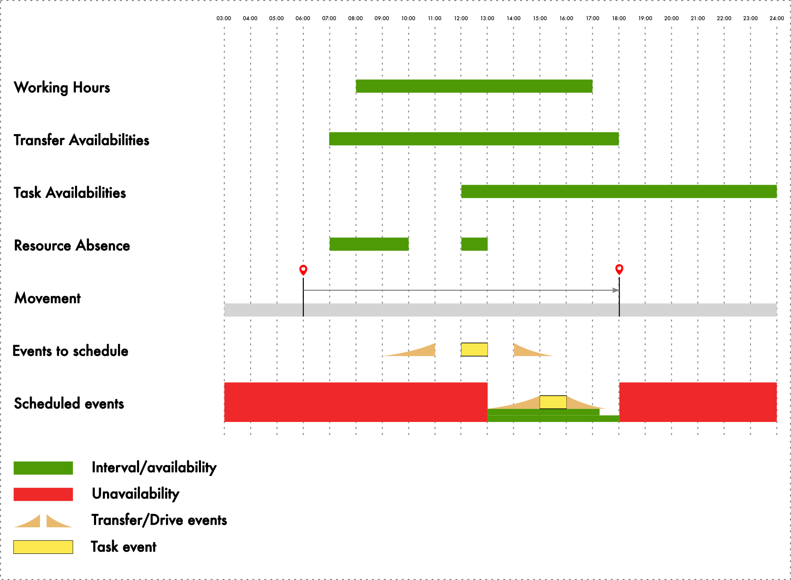

# TesseractLib

**TesseractLib** is a high-performance Java library designed for temporal and spatial data modeling. It was originally developed to address recurring challenges in our ticketing system, where appointments and events needed to be managed on complex timelines. Standard Java collections and utilities fell short when handling overlapping schedules, querying availability, or merging time intervals. This library emerged as a solution to simplify these operations, ensuring precision and efficiency.

## Why TesseractLib?

- **Temporal Primitives**: Simplify working with moments and intervals for operations like merging, querying, and algebraic manipulations.
- **Spatial Primitives**: Manage locations, distances, directions, and spatio-temporal tracking with ease.
- **Collections**: Store and query intervals and spatio-temporal data efficiently.
- **Boolean Algebra**: Perform set operations on intervals using `and`, `or`, and `not` for advanced temporal logic.

### Key Features
- **Scheduling Systems**: Manage overlapping schedules, availability windows, and calendar synchronization.
- **Resource Management**: Track equipment, vehicles, and personnel with time and location constraints.
- **Time Series Analytics**: Perform interval-based filtering, event processing, and historical analysis.
- **Location-Based Services**: Optimize routes, geofencing, and spatio-temporal queries.


## Example

Here's a quick look at how TesseractLib helps you wrangle schedules and absences with ease.



*Above: Scheduling complexity, visualized. Green blocks show time intervals—working hours, absences, or other constraints. Movements are pairs of locations in time (presences), marking where resources are already assigned. The challenge: fit tasks and transfers around these boundaries. TesseractLib helps bring order to the chaos.*

This example tackles the classic scheduling puzzle: finding time slots for tasks and transfers while juggling worker availability, absences, and movement. With interval collections and logical operations, TesseractLib pinpoints exactly when work can happen—no more guesswork.

In TesseractLib, you model the scenario with:

- `IntervalCollection` (IntervalSet) for disjoint time intervals (working hours, absences, task/transfer availabilities)
- `PresenceCollection` (PresenceSet) for time-location data (Presence), with a `movements()` method for Movement objects
- `Movement` as a pair of Presences representing travel from one location to another over time. 


```java
import com.fieldcode.tesseract.IntervalCollection;
import com.fieldcode.tesseract.IntervalQueryExecutor;
import com.fieldcode.tesseract.Movement;
import com.fieldcode.tesseract.Interval;
import static com.fieldcode.tesseract.IntervalCollections.*;
import static com.fieldcode.tesseract.IntervalQuery.*;


// First, we create a visit object using the task and movement details.
// The task must specify a location, which, together with movement data, 
// lets us determine how long it takes to get to and from the task (inbound and outbound durations).
// (the task and visit is not part of TesseractLib itself; it's just for this example)
var visit = calculateVisit(task, movement);

// Calculate intervals where a task can be scheduled, considering all constraints
var derivedTaskAvailabilities = and(
      workingHours,
      taskAvailabilities,
      not(absences),
      movement.getInterval()
);

// Calculate intervals for transfers, excluding holidays and considering movement
var derivedTransferAvailabilities = and(
    transferAvailabilities,
    not(absences),
    movement.getInterval()
);

// Build a schedule query using the calculated availabilities
var query = query(
    schedule(visit.inbound().duration(), derivedTransferAvailabilities),
    schedule(visit.task().duration(), derivedTaskAvailabilities).center(),
    schedule(visit.outbound().duration(), derivedTransferAvailabilities)
);

// Execute the query and print the resulting intervals
var results = IntervalQueryExecutor.execute(query);

results.getIntervals().forEach(System.out:println);
```

> **Note:** The `.center()` method means the earlier event (like a transfer) will be pulled to the start of the central task, aligning the schedule so everything fits neatly around the main activity.

## Get Started

Check out the [documentation](docs/fieldcode-tesseract.md) for detailed guides:
- [Temporal Primitives](docs/temporal-primitives.md)
- [Spatial Primitives](docs/spatial-primitives.md)
- [Interval Collection](docs/interval-collection.md)
- [Presence Collection](docs/presence-collection.md)

## Using


### Maven

To use TesseractLib in your project, add the following Maven dependencies:

```xml
<!-- Core library (most common) -->
<dependency>
  <groupId>com.fieldcode</groupId>
  <artifactId>tesseract-core</artifactId>
  <version>0.1.0</version>
</dependency>

<!-- Jackson support -->
<dependency>
  <groupId>com.fieldcode</groupId>
  <artifactId>tesseract-jackson-datatype</artifactId>
  <version>0.1.0</version>
</dependency>
```

### Gradle

To use TesseractLib in your project, add the following Gradle dependencies:

```gradle
implementation 'com.fieldcode.tesseract:tesseract-core:0.1.0'
implementation 'com.fieldcode.tesseract:tesseract-jackson-datatype:0.1.0'
```

**License**: MIT License. Contributions welcome!
